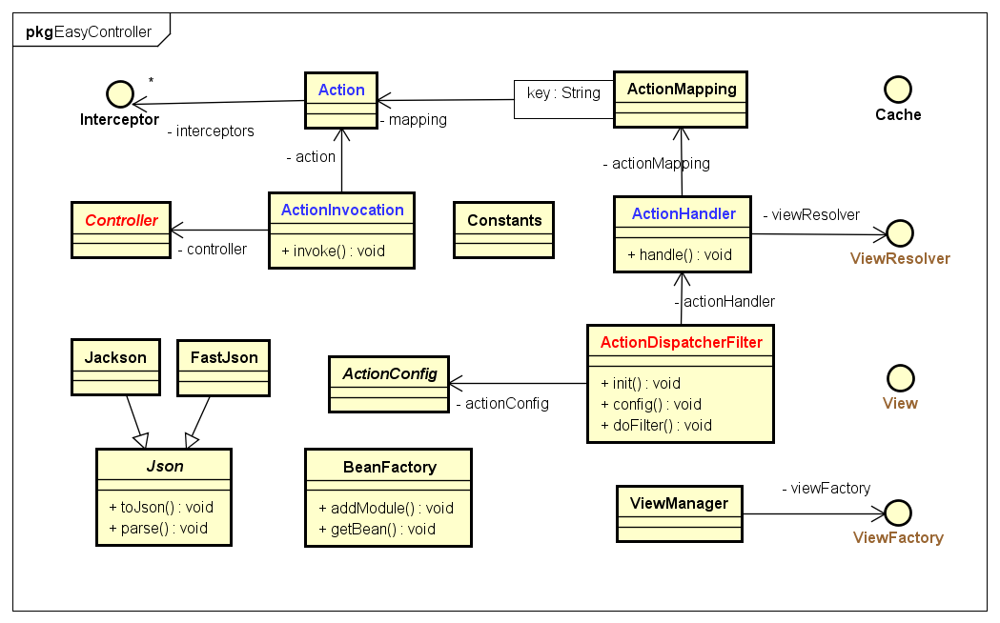

#EasyController

## 特点
- MVC模式
- IOC依赖注入
- 超轻量,级简,不到100K
- 配置简单
- 多视图支持

## UML


## 安装运行
1. 运行`install.bat` 首次运行要下载依赖会慢一些.
2. 运行`demo/jetty-run.bat` 访问 `http://127.0.0.1:8080/demo`

Maven使用,要先本地安装.
```xml
<dependency>
    <groupId>longshu.easycontroller</groupId>
    <artifactId>easycontroller</artifactId>
    <version>1.0.0</version>
</dependency>
```